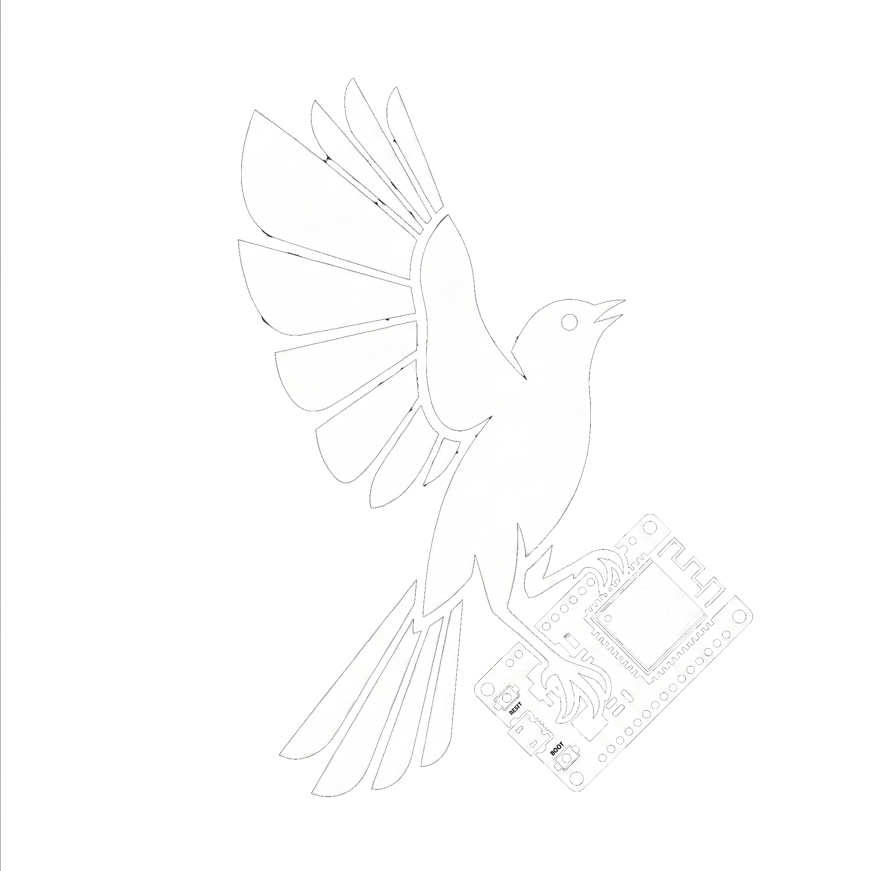

<table border="0" cellspacing="0" cellpadding="0">
<tr>
<td width="260" valign="middle"></td>
<td valign="middle"><h1>M&nbsp;O&nbsp;C&nbsp;K&nbsp;I&nbsp;N&nbsp;G&nbsp;B&nbsp;I&nbsp;R&nbsp;D</h1></td>
</tr>
</table>

A small home mesh network platform. A travel router as the WiFi anchor, a
Raspberry Pi as the subnet router and processing/storage backend, and a
fleet of ESP32 leaves — all reachable from a Tailscale tailnet via a
single advertised subnet.

```
       ┌── Tailscale tailnet ─────────────────────────────────────┐
       │                                                          │
       │   Noah's Mac, phone, Windows GPU box, etc. — all reach   │
       │   192.168.8.0/24 via the subnet route advertised by the  │
       │   Pi.                                                    │
       │                          │                               │
       └──────────────────────────┼───────────────────────────────┘
                                  │ wireguard
                                  ▼
                  ┌───────────────────────────────┐
                  │ Pi Zero W "mockingbird-pi"    │
                  │   subnet router               │
                  │   + collector + dashboard     │
                  └───────────────┬───────────────┘
                                  │ project SSID, 2.4 GHz
        ┌─────────────────────────┴───────────────────────────┐
        │                          │                          │
   ┌──────────┐         ┌────────────────────┐    ┌──────────────────┐
   │ Mac (dev)│         │ GL.iNet Opal       │    │ ESP32 leaves     │
   │          │         │ WiFi AP + NAT      │    │ ×8 deployed      │
   │          │         │ WAN → upstream     │    │ stream BLE obs   │
   │          │         │ 192.168.8.1        │    │ → Pi:9001 (TCP)  │
   └──────────┘         └────────────────────┘    └──────────────────┘
```

## Components

- **GL.iNet GL-SFT1200 "Opal"** — the WiFi anchor and NAT box. Joins
  an upstream household SSID over WiFi-as-WAN and rebroadcasts its own
  project SSID on 2.4 GHz with `192.168.8.0/24`. Does **not**
  run Tailscale — the daemon's ~67 MB of binaries don't fit on the
  Opal's 16 MB flash. It's a dumb AP from the platform's perspective.

- **Raspberry Pi Zero W "mockingbird-pi"** — Tailscale subnet router
  *and* the processing/storage backend. Joins the project SSID over
  WiFi, runs `tailscale up --advertise-routes=192.168.8.0/24` so peers
  reach everything on the LAN by 192.168.8.x. Hosts the BLE collector,
  the live dashboard, and the SQLite store under `~/mockingbird/`.

- **ESP32-WROOM-32 leaves** (8 deployed, ~3 spare). Each joins the
  project SSID, runs continuous NimBLE scanning, and **streams every
  observation as a line of JSON over TCP to `mockingbird-pi:9001`**.
  Discovery is mDNS-first (`mockingbird-pi.local`) with a build-time
  fallback host; the cached IP self-invalidates on connect failure so
  a Pi DHCP renumber heals the fleet automatically. HTTP on `:80`
  exposes `GET /`, `GET /version`, `POST /restart`; ArduinoOTA listens
  on UDP 3232.

## Shipped capabilities

- **Distributed BLE sensing.** 8 leaves stream ~110 obs/sec aggregate
  into the Pi's `observations.sqlite`. Zero drops, zero crashes under
  continuous heavy scanning.
- **MLE multilateration** with per-leaf TX/RX bias decomposition and a
  path-loss solver.
- **Kalman fusion + entity clustering.** Joseph-form Kalman with
  Tikhonov-regularized solves; multi-MAC tracks survive Apple Continuity
  MAC rotation. Adaptive ZUPT + velocity clamp kill phantom motion.
- **Live Three.js web dashboard** on `:8080` — heatmap, trails,
  click-to-select, bird codenames, north compass, debounced auto-save.
- **Wire-format contract tests + canary** under `tests/`.

See `docs/roadmap.md` for shipped-vs-planned and `docs/prds/` for the
in-flight Q3 capabilities (person fingerprinting, IMU on leaves, presence
& anomaly alerts).

## Layout

```
.
├── CLAUDE.md                          design notes + decisions log
├── README.md                          this file
├── firmware/esp32-wroom-mockingbird/  live ESP32 firmware (PlatformIO +
│                                      Arduino + NimBLE, OTA-enabled)
├── services/
│   ├── mockingbird-collector.py       :9001 TCP server, writes SQLite
│   ├── mockingbird-collector.service  systemd unit, auto-restart
│   ├── mockingbird-dashboard.service  systemd unit, auto-restart
│   ├── mockingbird-dashboard.py       :8080 dashboard backend
│   ├── dashboard.html                 Three.js dashboard frontend
│   ├── mockingbird_calibration.py     per-leaf TX/RX bias + path-loss
│   ├── mockingbird_tracks.py          Kalman fusion + entity clustering
│   └── pi/                            wlan0 wedge mitigation configs
├── scripts/
│   ├── bootstrap-pi-subnet-router.sh  idempotent Pi-side bootstrap
│   ├── deploy-pi-wlan-fix.sh          wlan0 wedge mitigation deploy
│   ├── gen-esp32-secrets.sh           generates firmware/src/secrets.h
│   ├── ble-experiment.sh              SSH wrapper around the analyzer
│   ├── analyze_ble_db.py              current SQLite-based analyzer
│   └── analyze_ble_capture.py         legacy JSON-file analyzer
├── tests/                             pytest — wire contract, RF math,
│                                      Kalman stability, track smoothing
├── docs/
│   ├── roadmap.md
│   ├── prds/                          Q3 PRDs
│   └── ops/                           runbooks + RCAs
├── main/                              aspirational ESP-IDF firmware for
│                                      future ESP32-S3 hardware — NOT
│                                      built or flashed on the fleet
├── tools/ota_serve.py                 OTA push helper
└── partitions.csv / sdkconfig.*       ESP32-S3 build inputs (main/)
```

## Bringing up the platform

The canonical bootstrap covers the Pi side. It expects
`~/repos/.scratch/pi-creds.txt` and `~/repos/.scratch/mockingbird-wifi.txt`
to exist locally (gitignored creds), and takes the Pi's current SSH host:

```bash
./scripts/bootstrap-pi-subnet-router.sh <pi-host>   # e.g. 192.168.0.128
```

It installs Tailscale, joins the project SSID, enables IP forwarding,
and advertises `192.168.8.0/24`. Approve the subnet route once at
<https://login.tailscale.com/admin/machines>; approval is sticky across
reflashes, but the local `--advertise-routes` pref must be re-set each
time the SD card is reimaged.

The Opal is **not** scripted — it's a one-time stock-firmware setup:
join the upstream household SSID as WiFi-as-WAN, rebroadcast the
project SSID on 2.4 GHz, install `openssh-server` on port 2222 (the
stock Dropbear 2017 doesn't accept modern keys).

## Adding a leaf

Any device that joins the project SSID is a member; the PSK lives in
a 0600 file outside the repo (path is in `CLAUDE.md`).

For an ESP32:

```bash
# regenerate firmware/.../src/secrets.h from your local creds file
./scripts/gen-esp32-secrets.sh

# first flash over USB
cd firmware/esp32-wroom-mockingbird
pio run -e usb -t upload

# subsequent updates over OTA
pio run -e ota -t upload --upload-port=mockingbird-<chipid>.local
```

Verify with `curl http://mockingbird-<chipid>.local/` — the JSON
response includes an `uplink` block (`connected`, `sent`, `dropped`,
`q_depth`, `host:port`) showing the leaf is streaming to the Pi.

## The `main/` firmware

`main/` holds an ESP-IDF design for **ESP32-S3** boards that would join
the tailnet directly via [MicroLink][microlink] — bypassing the subnet
router entirely. It is **not** flashed to the current WROOM-32 fleet,
which lack the PSRAM MicroLink requires. Kept for when S3 hardware
arrives; the rationale is in `CLAUDE.md` under "Why not Tailscale on
each ESP32?".

[microlink]: https://github.com/CamM2325/microlink
